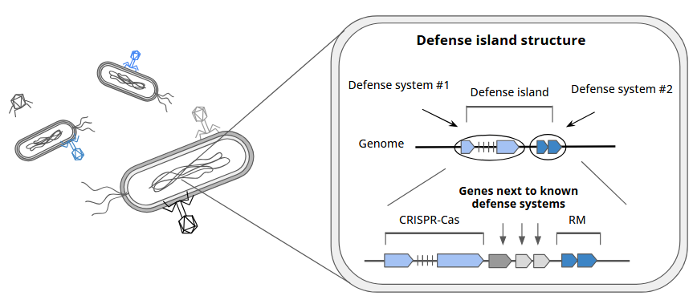
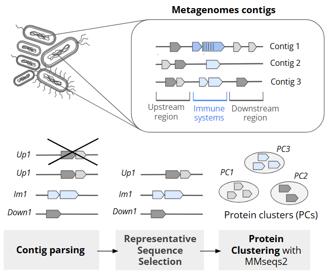
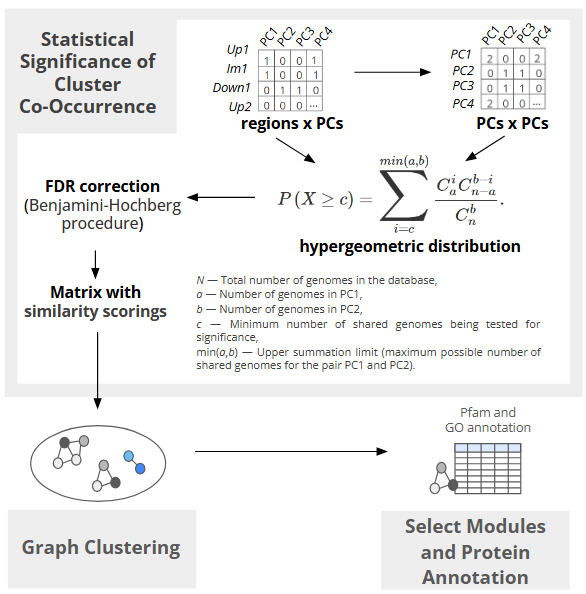

# Search of novel immunity systems in the metagenomes of microbial communities

**Authors**  
- Vera Subrakova
- Sofiia Borovikova

**Supervisors**  
- Oksana Kotovskaya (Skolkovo Institute of Science and Technology)
- Polina Gorshenina (Skolkovo Institute of Science and Technology)

### Introduction

Bacteria are constantly exposed to the threat of infection by bacteriophages, and in response they have developed a variety of defense systems. The best known systems include the restriction-modification (R-M) system, which recognizes and cuts foreign DNA, and the CRISPR-Cas system, which provides acquired immunity by “remembering” previously attacked phages. In the genomes of microorganisms, immune systems often colocalize with each other, forming protective islands. These regions are an excellent target for finding new immune systems, since previously unexplored systems can colocalize with already known ones.

Thus, the goal of the project is to **find new immune systems in bacteria** by analyzing genes that colocalize with already known systems on a new metagenome dataset.

<div align="center">
  
</div>

### Data

A total of 217 novel bacterial metagenome samples were collected from the following sources: marine sediments (41%), host-associated organisms (26%), seaweed (14%), water (11%), rhizosphere (4%), plants (2%), and microbial mats (1%). The dataset exhibits the following taxonomic composition: Proteobacteria, Actinobacteriota, Firmicutes, and minor contributions from Cyanobacteria, Bacteroidota, and Planctomycetota. 

Prior to this analysis, the samples were screened for immune systems using PADLOC [1] and DefenseFinder [2] tools. 

Data is presented in GenBank format, see example in the `./data/gbk` folder.

### Workflow

1) **Contig Parsing**

To find novel immune systems that co-localize, contigs were split into three parts: upstream, immune system, and downstream regions. In this way, proteins would be situated in the same region. Run this command from data/gbk folder:

```{bash}
./1_parsing_gbk.sh
```
As a result, two folders are created: `./data/splitted_fna` with parsed nucleotide sequences and `./data/splitted_faa` with parsed amino acid sequences. 

2) **Representative Sequence Selection**

Metagenome samples are full of redundant data. To generate a non-redundant sequence set, metagenomic contigs were clustered using MMseqs2 (params: `--min-seq-id 0.95 -c 0.35`), and only representative sequences were retained for downstream analysis.

3) **Protein Clustering**

To group homologous proteins, amino acid sequences were clustered with MMseqs2 (params: `--min-seq-id 0.4 -c 0.8`), yielding protein clusters (PCs).

<div align="center">
  
</div>

To perform clustering of nucleotide sequences, getting representative sequences, selection of amino acid sequences and followed protein clustering run:

```{bash}
./2_clusterin.sh
```
As a result, three additional folders are created in `./data` folder.
Next steps of pipline are described in `.ipynb` notebooks.

4) **Statistical Significance of Cluster Co-Occurrence**:

To identify PCs with statistically significant co-localization patterns in genomic regions, we performed the following analysis pipeline: binary matrix → co-occurrence → hypergeometric p-values → FDR correction → similarity scoring;

5) **Graph Clustering**

To group frequently co-localizing PCs into functional units, we applied MCL graph clustering (inflation = 2);


6) **Select Modules and Protein Annotation**

We manually selected non-immune modules (containing no annotated defense system proteins) with large protein clusters (>20 members), high co-occurrence (more tnan 70% in the smallest cluster) and low pairwise distance (distance between proteins in single region).

<div align="center">
  
</div>

### Results

We developed a computational pipeline to identify co-occurring protein clusters and infer functional modules from metagenomic data. Protein clusters with fewer than two proteins were filtered out to reduce noise. A binary presence-absence matrix of protein clusters across genomic regions was created, and co-occurrence was quantified via the dot product of this matrix with its transpose.

To assess significance, we applied the hypergeometric test, corrected p-values with the Benjamini-Hochberg method, and converted them to similarity scores using a negative log10 transformation with a threshold filter. Normalizing these scores by row sums produced a transition probability matrix, which was clustered using the Markov Cluster Algorithm.

This approach identified approximately 21,000 functional modules, mostly small (1–2 clusters), forming a sparse similarity graph typical of biological systems. Modules showed clear functional separation, containing predominantly immune or non-immune proteins, demonstrating effective modularization.

We further filtered modules for size (>20 proteins) and strong co-occurrence, parsing GO and Pfam annotations. Five notable modules were highlighted, including ParED-, VapBC-, and HipAB-like toxin-antitoxin systems; a CBASS-like module with thymidylate kinase and putative effector; and a LUD-like module potentially linked to oxidative stress response.

**Requirements for the pipeline**: 

This project requires the following Python packages:

```
biopython==1.78  
mmseqs2==17.b804f  
pandas==2.2.3  
numpy==1.26.4  
scipy==1.15.1  
markov-clustering==0.0.6.dev0  
matplotlib==3.10.0  
seaborn==0.13.2  
```

You can install them using:

```{bash}
conda create -n defense_explorer python=3.10
conda activate defense_explorer
pip install -r dependencies.txt
```

### Literature
1. Leighton J Payne, Sean Meaden, Mario R Mestre, Chris Palmer, Nicolás Toro, Peter C Fineran, Simon A Jackson, PADLOC: a web server for the identification of antiviral defence systems in microbial genomes, Nucleic Acids Research, Volume 50, Issue W1, 5 July 2022, Pages W541–W550, https://doi.org/10.1093/nar/gkac400
2. Tesson, F., Hervé, A., Mordret, E., Touchon, M., d'Humières, C., Cury, J., & Bernheim, A. (2022). Systematic and quantitative view of the antiviral arsenal of prokaryotes. Nature communications, 13(1), 2561. https://doi.org/10.1038/s41467-022-30269-9