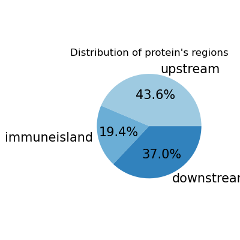

# Search of novel immunity systems in the metagenomes of microbial communities

**Authors**  
- Vera Subrakova
- Sofiia Borovikova

**Supervisors**  
- Oksana Kotovskaya (Skolkovo Institute of Science and Technology)
- Polina Gorshenina (Skolkovo Institute of Science and Technology)

### Introduction

Bacteria are constantly exposed to the threat of infection by bacteriophages, and in response they have developed a variety of defense systems. The best known systems include the restriction-modification (R-M) system, which recognizes and cuts foreign DNA, and the CRISPR-Cas system, which provides acquired immunity by “remembering” previously attacked phages. In the genomes of microorganisms, immune systems often colocalize with each other, forming protective islands. These regions are an excellent target for finding new immune systems, since previously unexplored systems can colocalize with already known ones.

Thus, the goal of the project is to **find new immune systems in bacteria** by analyzing genes that colocalize with already known systems on a new metagenome dataset.

<div align="center">
  
</div>

### Data

A total of 217 novel bacterial metagenome samples were collected from the following sources: marine sediments (41%), host-associated organisms (26%), seaweed (14%), water (11%), rhizosphere (4%), plants (2%), and microbial mats (1%). The dataset exhibits the following taxonomic composition: Proteobacteria, Actinobacteriota, Firmicutes, and minor contributions from Cyanobacteria, Bacteroidota, and Planctomycetota. 

Prior to this analysis, the samples were screened for immune systems using PADLOC [1] and DefenseFinder [2] tools. 

Data is presented in GenBank format, see example in the `./data/gbk` folder.

### Workflow

1) **Contig Parsing**

To find novel immune systems that co-localize, contigs were split into three parts: upstream, immune system, and downstream regions. In this way, proteins would be situated in the same region. Run this command:

```{bash}
./1_parsing_gbk.sh
```
As a result, two folders are created: `./data/splitted_fna` with parsed nucleotide sequences and `./data/splitted_faa` with parsed amino acid sequences. 
Note: for the sake of demonstration, here we provided example.gbk file with jibbery protein sequences and coordinates. Nevertheless, the script extracts protein sequences and nucleoride sequences based on region from example.gbk (upstream, immune system, and downstream regions). 

2) **Representative Sequence Selection**

Metagenome samples are full of redundant data. To generate a non-redundant sequence set, metagenomic contigs were clustered using MMseqs2 (params: `--min-seq-id 0.95 -c 0.35`), and only representative sequences were retained for downstream analysis.

3) **Protein Clustering**

To group homologous proteins, amino acid sequences were clustered with MMseqs2 (params: `--min-seq-id 0.4 -c 0.8`), yielding protein clusters (PCs).

<div align="center">
  
</div>

To perform clustering of nucleotide sequences, getting representative sequences, selection of amino acid sequences and followed protein clustering run:

```{bash}
./2_clustering.sh
```
As a result, three additional folders are created in `./data` folder: `nuc_mmseq_results/`(information about nucleotide clustering),`filtrated_faa`(information about filtratition step),`mmseq_results`(information about protein clustering)).

```text
data/
│
├── nuc_mmseq_results/ # nucleotide clustering data (hidden)
├── filtrated_faa/     # results of representative filtrating (hidden)
├── mmseq_results/     # protein clustering data (partly hidden)
│            ├── 3_output_csv
│                     ├── DB_clu.tsv # final table with protein cluster
│                                             name and protein name
├──...

```
Next steps of pipline are described in `analyze_modules.ipynb` notebook. Additional graphs are presented in `graph-statistics.ipynb` notebook.

4) **Statistical Significance of Cluster Co-Occurrence**:

To identify PCs with statistically significant co-localization patterns in genomic regions, we created a binary presence-absence matrix of protein clusters across genomic regions. To assess significance, we applied the hypergeometric test, corrected p-values with the Benjamini-Hochberg method, and converted them to similarity scores using a negative log10 transformation. Similar approach was deascribed in artical [3].

5) **Graph Clustering**

To group frequently co-localizing PCs into functional units, we applied MCL graph clustering (inflation = 2);

6) **Select Modules and Protein Annotation**

We manually selected non-immune modules (containing no annotated defense system proteins) with large protein clusters (>20 members), high co-occurrence (more tnan 70% in the smallest cluster) and low pairwise distance (distance between proteins in single region).

<div align="center">
  
</div>

### Results

From an initial 948K amino acid sequences extracted from GenBank files, we selected 730K high-quality representatives. MMseqs2 clustering produced 362K protein clusters. To ensure robust analysis, we retained only clusters containing three or more proteins, yielding 43K high-confidence clusters. The size distribution of these filtered clusters is shown below.

<div style="display: flex; justify-content: center; gap: 20px;">
  
  
</div>

Through a multi-stage analytical pipeline involving Steps 4 and 5, we identified 21K functional modules. After removing singleton modules, we assessed the separation between modules enriched with immune-related proteins versus those primarily composed of non-immune proteins. The module size distribution and comparison of immune fraction distribution are presented below.

<div style="display: flex; justify-content: center; gap: 20px;">
  
  
</div>

From 21K modules, we selected those with >20 proteins per cluster and no immune system proteins. Only modules consisting of two protein clusters met these criteria. We chose modules with short pairwise distances (1–2 proteins) and a high occurrence of clusters (>70% for the smallest cluster), identifying 5 notable candidates likely bearing immune system features. 

In the first three modules, one of the proteins belonging to the toxin-antitoxin systems was identified, while the other two modules contain undefined Pfam and GO proteins, making it difficult to predict the functions of the system.

<div align="center">
  
</div>

Final table contatin all discovered modules located in `./data/tables/filtrated_results_annotated.csv` and have the next columns:


| Field             | Description                                                                 |
|-------------------|-----------------------------------------------------------------------------|
| `module_id`       | Module number                                                               |
| `module_size`     | Module size (number of protein clusters in the module)                      |
| `cluster_id`      | Protein cluster name                                                        |
| `cluster_ind`     | Protein cluster index number                                                |
| `cluster_sizes`   | Protein cluster size (number of proteins in protein cluster)                |
| `coocurance`      | Region co-occurrence (number of identical regions across all module clusters)|
| `immune`          | Number of immune proteins in the module                                     |
| `average_distance`| Average pairwise distance between clusters in the same region               |
| `GO_terms`        | GO term annotation                                                          |
| `pfam_term`       | Pfam annotation                                                             |
| `region`          | Frequency count of the region's occurrence                                  |


**Requirements for the pipeline**: 

This project requires the following packages:

```
biopython==1.78  
mmseqs2==17.b804f  
pandas==2.2.3  
numpy==1.26.4  
scipy==1.15.1  
markov-clustering==0.0.6.dev0  
matplotlib==3.10.0  
seaborn==0.13.2
networkx==3.4.2  
```

You can install them using conda:

```{bash}
conda env create -n defense_explorer -f environment.yml python=3.10
conda activate defense_explorer
```

### Literature
1. Leighton J Payne, Sean Meaden, Mario R Mestre, Chris Palmer, Nicolás Toro, Peter C Fineran, Simon A Jackson, PADLOC: a web server for the identification of antiviral defence systems in microbial genomes, Nucleic Acids Research, Volume 50, Issue W1, 5 July 2022, Pages W541–W550, https://doi.org/10.1093/nar/gkac400
2. Tesson, F., Hervé, A., Mordret, E., Touchon, M., d'Humières, C., Cury, J., & Bernheim, A. (2022). Systematic and quantitative view of the antiviral arsenal of prokaryotes. Nature communications, 13(1), 2561. https://doi.org/10.1038/s41467-022-30269-9
3. Bolduc B, Jang HB, Doulcier G, You Z, Roux S, Sullivan MB. 2017. vConTACT: an iVirus tool to classify double-stranded DNA viruses that infect Archaea and Bacteria. PeerJ 5:e3243 https://doi.org/10.7717/peerj.3243
